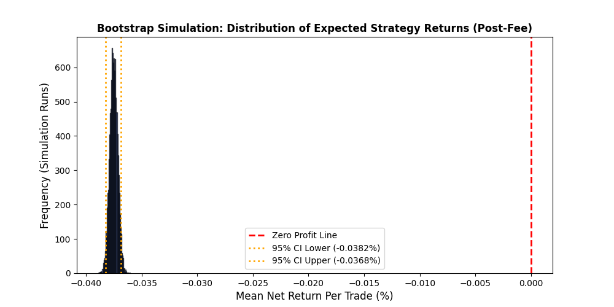

# Crypto Market Microstructure Research
An empirical study of crypto order book imbalance, short-horizon return prediction, regime persistence, and execution feasibility using Binance order book data.

# **1. Research Motivation**

This project investigates whether short-horizon order book imbalance contains statistically meaningful predictive information about future mid-price movements and market state persistence in crypto markets.

Rather than relying on global correlations, the research focuses on conditional market regimes, persistence dynamics, and execution feasibility under transaction costs.

# **2. Research Questions**
- Does order book imbalance predict short-horizon future returns?
- Does volatility affect imbalance persistence?
- How long does imbalance memory survive?
- Are observed patterns statistically significant or random noise?
- Can statistical edge survive realistic transaction costs?

# **3. Data**
|  | Research Data Set  | Testing Data Set |
| -------- | ------------- | ------------- |
| File | BTCUSDT_log_longhour.csv | BTCUSDT_orderbook_v2.csv |
| Exchange | Binance | Binance |
| Asset | BTCUSDT Perpetual | BTCUSDT Perpetual |
| Frequency | 5-second order book snapshots | 5-second order book snapshots |
| Duration | ~3 hours | ~6 hours |
| Observations | 2000+ snapshots | 4000+ snapshots |
| Data Source | ccxt API | ccxt API |

# **4. Feature Engineering**

### **Mid Price**

## $Mid Price = \frac{P_{bids}*Q_{bids}+P_{asks}*Q_{asks}}{Q_{bids}+Q_{asks}}$

### Order Book Imbalance
## $Imbalance Score = \frac{BidDepth_{t}-AskDepth_{t}}{BidDepth{t}+AskDepth_{t}}$

*Values near +1 indicate dominant bid-side pressure, while values near -1 indicate dominant ask-side pressure.*

### Forward Return

## $Return_{t+h} = \frac{MidPrice_{t+h} - MidPrice_t}{MidPrice_t}$

# **Rolling Autocorrelation**

### Rolling Memory

Rolling autocorrelation was used to estimate short-horizon persistence of imbalance states.

No need complicated formula here.

# **5. Methodology**
## **Regime Segmentation**

The imbalance signal was discretized into five conditional regimes:

- Extreme Sell [-1.0, -0.6]
- Weak Sell [-0.6, -0.2]
- Neutral [-0.2, 0.2]
- Weak Buy [0.2, 0.6]
- Extreme Buy [0.6, 1.0]

# **Volatility Conditioning**

Market states were further segmented into high-volatility and low-volatility environments to examine persistence breakdown during turbulent conditions.

# **Alpha Decay**

Autocorrelation decay profiles were computed to estimate signal memory and execution horizons.

# **Statistical Validation**

The following statistical methods were applied:

- Wilcoxon Signed-Rank Test
- Mutual Information Analysis
- Bootstrap Resampling

# **6. Key Findings**

## Conditional Return Structure

Extreme imbalance states showed monotonic directional drift in future short-horizon returns.

## Volatility vs Persistence

Volatility spikes were associated with collapsing autocorrelation and reduced market memory.

## Alpha Decay

Signal persistence decayed significantly after approximately 20 seconds.

## Streak Duartion
Distribution of Streak Durations within 12 seconds when Imbalance Score > 0.6

# **7. Statistical Results**

## Statistical Validation

### Wilcoxon Signed-Rank Test
#### DIRECTIONAL CONSISTENCY TEST (Wilcoxon Rank)

- P-Value: 0.00000000010372765054

Result:
- STATISTICALLY SIGNIFICANT. The upward drift is a consistent market reality. (Not is random signal)

### Mutual Information
- Imbalance →  Future Return Information Link:  0.0759
- Volatility → Future Return Information Link: 0.3024

# **8. Backtest & Execution Reality**

## Trading Feasibility

Although statistically significant directional structure was detected, the strategy failed after realistic transaction costs.

### 📊Results

||BACKTEST RESULTS|
|--------------|------|
|Total Trades Triggered| 2511
|Win Rate (Post-Fee)|    2.19%|
|Gross PnL (No Fees)|    6.1804%|
|Net PnL (After Fees)|    -94.2596%|
|Profitability Probability (Bootstrap)| 0.00%|

** > Statistical predictability does not necessarily imply executable alpha after fees and turnover. **

# **9. Limitations**

## Limitations

- Limited observation window
- Single exchange analysis
- No queue position modelling
- No slippage modelling
- No latency-aware execution engine
- No cross-exchange liquidity analysis

# **10. Future Work**

## Future Work

- Multi-exchange synchronization
- Latency-aware execution simulation
- Queue position modelling
- Adaptive regime-switching models
- Reinforcement learning execution policies
